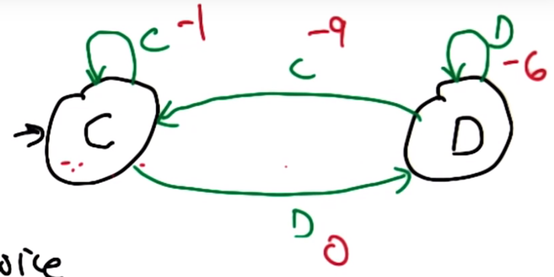
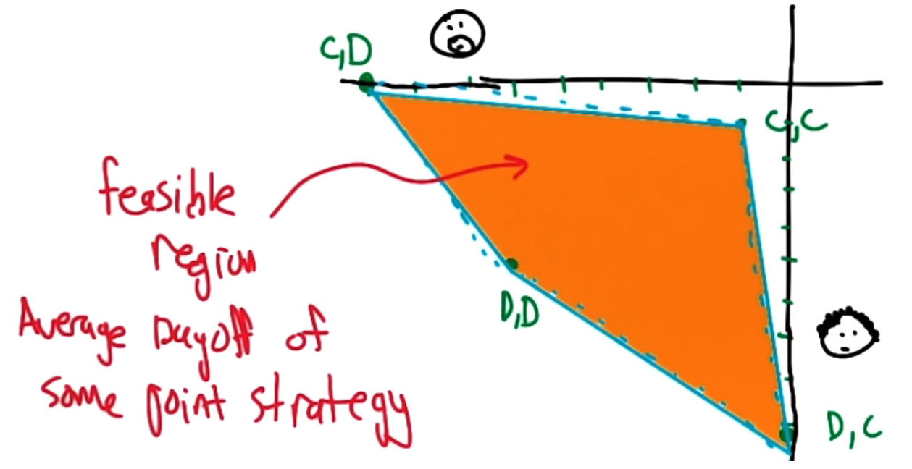
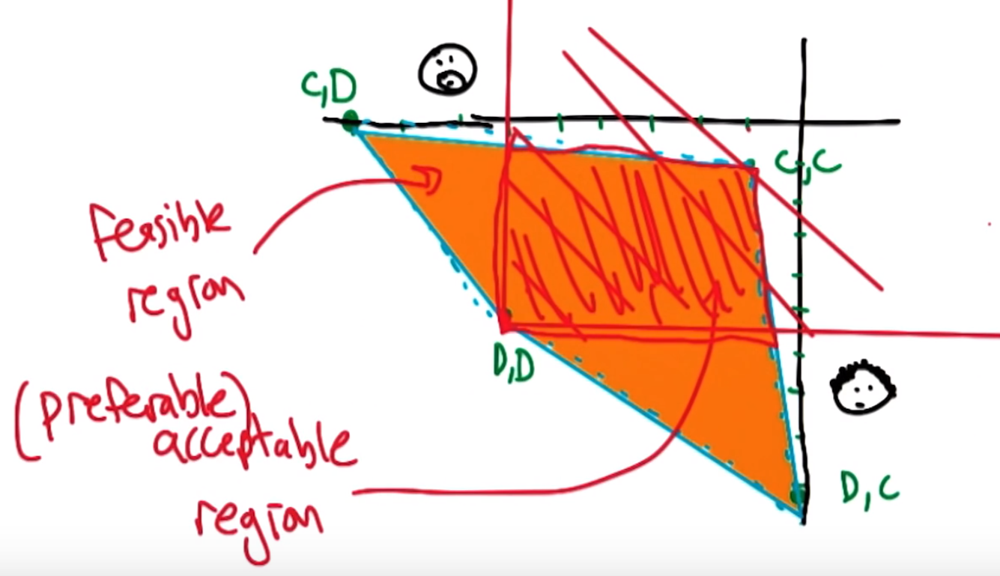

# Lesson 03: Game Theory Continued

## Iterated Prisoner's Dilemma (IPD)

Value (A, B) | B coop | B defect
-------------|--------|---------
A coop       | -1, -1 | -9, 0
C defect     | 0, -9  | -6, -6

If the Prisoner's Dilemma is conducted for multiple times, there is nothing more for them to do: it turns out that they always defect each other.

What happens if the number of the rounds is left unknown? It make difference.

### Uncertain End: Discounting

With the probability $\gamma$ (the same notation as the discount factor), the game continues after each round. Every round could be your last round, or not.

Expected number of rounds ($\gamma<1$)?
$$\frac{1}{1-\gamma}$$

### Tit for Tat

Since the ending is uncertain, we cannot use the representation with the finite state space (like the tree).

**Tit for tat (TFT)**: a famous IPD strategy.

* At the first round, the player will cooperate.
* In the all future round, the player will copy the opponent's previous move.

### Facing TFT

What is the best strategy facing the TFT?

If we always defect, expected total rewards: $0 + \frac{-6\gamma}{1-\gamma}$.
* which is good when the $\gamma$ is low. (The game tends to end soon)
* When the game only is played for one round, then immediately defecting is wise.

If We always co-op, expected total rewards: $\frac{-1}{1-\gamma}$.

* Best for high $\gamma$. (The game tends to continue longer)

For what $\gamma$ they are equally good? $\gamma=1/6$.
* When $\gamma$ is less than 1/6, the game will end soon, the player should defect.

## Finite State Strategy

Facing TFT: States labeled with the opponent's (the player using TFT) strategy. Edges labeled with our strategy and annotated with our payoff for that choice.

Our choice impacts an payoff and future decisions of the opponent.

* Matrix is all we needed when the game is played **only once**.
* MDP! We can use our methods in MDP to solve this.

Our policy facing TfT:
1. always coop
2. always defect
3. play the opposite of the opponents previous move (also TfT): D-C-D-C...

### What is the best response to each strategy?

Mutual Best Reponse: Pair of strategies that are the best response to each other. **Nash Equilibrium**!

Note:
* Now that besides the always defect for both, TFT for both is also a N.E.
* We have changes the game structure: now the value has been the total rewards among multiple rounds of game and the number of rounds is unknown.

## Repeated Game and the Folk Theorem

General idea: In repeated games, the possibilty of retailation opens the door for cooperation.

**"Folk Theorem"** (Oral tradition): **In mathematics**, results are known, at least to some experts to the field, and considered to have established status, but not published in complete form.

In game theorem, Folk Theorem refers to a particular result: Describes the set of payoffs that can result from Nash strategy in repeated game.

### Two-player plot

**Feasible region**: Average payoff of some possible joint strategy.

For Prisoner's Dilemma:

### Minimax Profile

Pair of payoffs, one for each player, that represent the payoffs that can be achieved by a player defending itself from a malicious adversary.

* Malicious adversary: Trying to minimize my score.
* Zero-sum game: an example for malicious adversary.

### Security Level Profile

**Acceptable region**: The region where both players can get more than what he can guarentee itself can get in an adversarial situation.

### Folksy Theorem

Any feasible payoff profile that strictly dominates the minimax/security level profile can be realized as a Nash Equilibrium payoff profile, with sufficient large discount factor ($\gamma \rightarrow 1$).

**Proof**: If it strictly dominates the minimax, then both can use it as a threat. Then it is better off for both to do what they are told.

#### Grim Trigger

"if your dare to cross the line, I swear I will spend all my life to make you pay."

Such strategy will make a worse payoff for the opposite not to follow the instruction.

### Implausible Threats

Such threat of revenging forever is too crazy, not a good response.

We are more interested in a plausible threats, corresponding to **subgame perfect**: each player is always take the best response, independent of the history.

If Grim is playing with the TFT:

* Is this a Nash Equilibrium? Yes, they will always cooperate.
* Is this a subgame perfect? No, if TfT starts with D, then they will defect each other forever, which means such threat is implausible.

### Pavlov

Cooperate if agreed, defect if disagree.

Pavlov vs. Pavlov: They are in Nash Equilibrium. They will always cooperate and no reason to deviate.

**Pavlov is subgame perfect**:

* If both cooperate, they will cooperate forever.
* If both defect, they will both switch to cooperate in the next turn.
* If A defect, B cooperate, then they will both defect in the next turn, and then both cooperate next.

They will end up being the mutual cooperate state. And it is a plausible threat.

### Computational Folk Theorem

In a 2-player bimatrix averaged reward repeated ($\gamma \rightarrow 1$) game.

Then we can build a Pavlov-like machine for any game and use that to construct subgame perfect Nash equilibrium for any game in polynomial time.

* If it is possible for us to build mutual beneficial relationship, then we can build the pavlov-like machine quickly.
* If it is zero-sum game, then we can solve linear programming, in polynomial time and work out the strategy.

## Stochastic Game and multi-agent RL

MDP for RL is stochastic game for multi-agent RL.

There are multiple Nash Equilibriums in terms of the policy pair.

### Stochastic Games (Shapley)

* $S$, States
* $A_i$, Action for player $i$: $a,b \quad a\in A_1, b\in A_2$.
* $T$, transition: $T(s,(a,b),s')$.
* $R_i$, reward for player $i$: $R_1(s, (a,b))\; R_2(s, (a,b))$
* $\gamma$: discount factor.

**Models**:

1. $R_1=-R_2$: zero-sum stochastic game
2. $T(s,(a,b),s') = T(s,(a,b'),s') \text{ and } R_1(s, (a,b)) = R_1(s, (a,b'))\;\forall b' \text{ and } R_2 = 0$: MDP.
3. $|S|=1$: repeated game.

### Zero-sum Stochastic Games

Updated Bellman equation:

$$Q_i^*(s,(a,b)) = R(s,(a,b)) + \gamma \sum_{s'}T(s,(a,b),s')\;\underset{a',b'}{minimax}Q_i^*(s',(a',b'))$$

Q-learning update rule (minimax-Q):

$$<s,(a,b),(r_1,r_2),s'>: \;Q_i(s,(a,b))\overset{\alpha}{\leftarrow}r_i+\gamma \;\underset{a',b'}{minimax}Q_i(s',(a',b'))$$

Note here, for example, minimax for player 1 (who has action $a$) means:

$$\underset{a',b'}{minimax}Q_i^*(s',(a',b')) = \underset{a'}{max}\;\underset{b'}{min} Q_i^*(s',(a',b'))$$

**Property**:

* Value iteration works
* minimax-Q converges
* unique solution to $Q^*$.
* Policies can be computed independently.
* update dfficient
* Q function sufficient to specify the policies.

### General-sum Stochastic Games

Updated Bellman equation:

$$Q_i^*(s,(a,b)) = R(s,(a,b)) + \gamma \sum_{s'}T(s,(a,b),s')\;\underset{a',b'}{Nash}Q_i^*(s',(a',b'))$$

Q-learning update rule (Nash-Q):

$$<s,(a,b),(r_1,r_2),s'>: \;Q_i(s,(a,b))\overset{\alpha}{\leftarrow}r_i+\gamma \;\underset{a',b'}{Nash}Q_i(s',(a',b'))$$

**Property**:

* Value iteration doesn't work
* Nash-Q doesn't work
* No unique solution to $Q^*$.
* Policies cannot be computed independently.
* update not dfficient (unless P=PPAD)
* Q function not sufficient to specify the policies.

## Lots of ideas

* repeated stochastic games (Folk Theorem)
* cheap talk -> correlated equilibrium
* cognitive hierarchy -> best response
* side payment (cooperative competitive value)

## Summary

* Iterated PD
* Connect IPD & RL (discounting) repeated game
* Folk Theorem (threats)
* implausible threats, subgame perfect
* Computational Folk Theorem
* Stochastic games, generalize MDP to repeated games
* Zero-sum stochastic game -> minimax-Q works
* Zero-sum stochastic game -> Nash-Q doesn't

...
